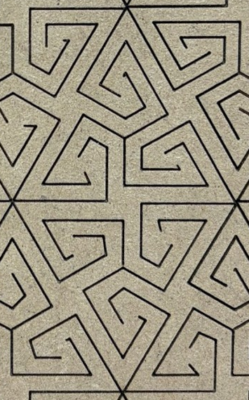
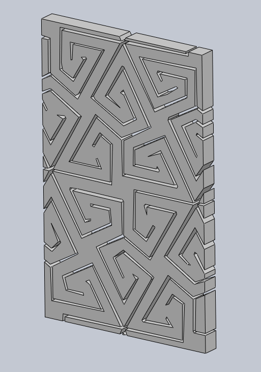

# Dispersion-Analysis-Research
My work with dispersion research modeling in Dr. Pal's Mechanics of Metastructures research lab!

One of the things I needed to do first, in the interest of speeding up base tasks, was write a program that would use an LLM to analyze an image of a sketch and create it for the user as an extruded part in SolidWorks. I have written the program here and am now looking towards importing this into COMSOL Multiphysics for dispersion analysis.

Here is what my program produced for one of the parallelograms concatenated for research testing:

<table align="center">
  <tr>
    <td>
      
    </td>
    <td valign="middle" align="center">
      →
    </td>
    <td>
      
    </td>
  </tr>
</table>

The next goal is to documenting how the part reacts to dynamic excitations with in-lab experiments and calculating the error between this and dynamic excitations on lattices using governing equations on COMSOL. 
